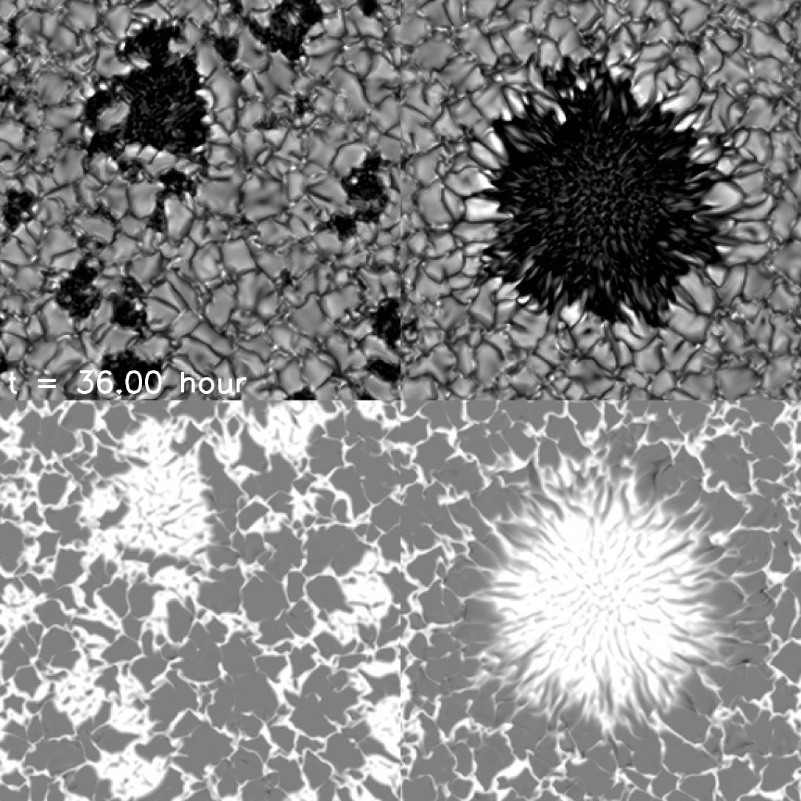

# 書物するためのwiki


## 用途: 考え中

### 案1: ブログ

まずこれが思いつく。

楽だし。

ただ日付で勝手にindexingしてくれないのがちょっと。

自分でディレクトリ内をサーチしてblog/index.mdに書けばよいのかも。


### 案2: Qiita的なTips

Qiitaでいいじゃん的な部分はある。


### 案3: マニュアル・コード

コードのホストも出来るのだろうか。

でも公開していいコードなら公開ディレクトリにおけばいいが。
だめなコードでもwebでマニュアル見れると便利かもしれない。

ただ、マニュアルをjupyterにするならあんまり良いことないか？
ちゃんとしたコードならread-the-docsで良いし。

公開コード(かつ小規模でwiki構造が複雑にならない)ならGithub Wikiのが良い可能性も。


### 案4: 特にカテゴリなく突発的に人に共有したいドキュメント

何があるだろ。マニュアルとか？


## 機能のテスト


### 数式の表示

Typoraの普通の記法はだめだった。


### 画像ファイルの表示

```markdown

```


```html

```


